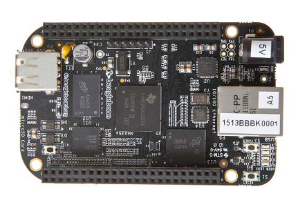

## São Paulo Aberta

> São Paulo Aberta é uma iniciativa do governo municipal que visa articular, integrar e fomentar ações de governo aberto na Prefeitura Municipal de São Paulo.

> Governo Aberto é um conjunto de iniciativas articuladas de transparência, participação, inovação e integridade nas políticas públicas.  A cidade de São Paulo implementa esta agenda ao desenvolver estratégias para:
>
> - Ampliar os processos de participação na tomada de decisões;
> - Garantir a transparência, por meio do acesso às informações públicas;
> - Desenvolver processos que estimulem a integridade e reponsabilização do poder público e seus agentes;
> - Fomentar a criação e uso de ferramentas de inovação tecnológica e social.

Fonte: [São Paulo Aberta](http://saopauloaberta.prefeitura.sp.gov.br/index.php/institucional)

Através de um edital a prefeitura selecionou 48 pessoas para serem "agentes formadores na cultura de governo aberto", ou seja, pessoas para desenvolverem oficinas relacionadas a governo aberto.
[Formulário para inscrição nas oficinas](https://docs.google.com/forms/d/1ls3HTTN-2VA24noPghfH2wBAtIAsdB-IGahoFkIj13s/viewform).

## Orçamento

> O orçamento da cidade nada mais é do que a previsão de tudo o que o município irá receber de recursos no ano seguinte e de onde será gasto esse dinheiro.

> [T]odos os anos a Prefeitura faz um Projeto de Lei Orçamentária (Ploa) que é analisado, modificado e aprovado pelos vereadores, na Câmara Municipal, tornando-se assim a Lei Orçamentária Anual (LOA), o orçamento de cada ano.

> Para o ano de 2015 a Prefeitura de São Paulo está planejando arrecadar e gastar quase R$ 51 bilhões. 

Informações reproduzidas do site [Orçamento Cidadão](http://planejasampa.prefeitura.sp.gov.br/orcamento-cidadao).

[Dados orçamentários](http://orcamento.prefeitura.sp.gov.br).

## Pedidos de Informação

> Lei de Acesso à Informação ([Lei Federal nº12.527/2011](http://www.planalto.gov.br/ccivil_03/_ato2011-2014/2011/lei/l12527.htm)), conhecida como "LAI", [...] estabelece uma séria de obrigações ao poder público: prazos, responsáveis, canais de atendimento online e físicos.

Pedidos online, no município de São Paulo, devem ser feitos pelo [e-SIC (Sistema Eletrônico do Serviço de Informações ao Cidadão)](http://esic.prefeitura.sp.gov.br).

> A LAI vale para os três poderes (Legislativo, Judiciário e Executivo) e em todas as esferas de governo: federais, estaduais, municipais e distritais.
> Estão obrigadas a cumprir a LAI toda a administração pública direta (órgãos públicos) e indireta (empresas públicas, autarquias, fundações etc.).

> Caso uma solicitação não seja atendida, é possível recorrer. [...] Todos esses passos podem ser feitos no próprio e-SIC.

É possível recorrer até 3 vezes, e a cada recurso o pedido será analisado por uma pessoa ou grupo diferente:

1. Autoridade máxima do órgão ou entidade municipal que respondeu
2. Controladoria Geral do Município
3. Comissão Municipal de Acesso à Informação

Uma vez feito o pedido de informação, o órgão tem 20 dias para respondê-lo.
Caso o órgão apresente uma justificativa, esse prazo pode ser ampliado em 10 dias.
Após receber uma resposta o prazo para recurso é de 10 dias.
O prazo para análise do recurso e parecer é de 5 dias.

> Dicas para um bom pedido de informação:
> 
> 1. Uma de cada vez
> 2. Seja preciso(a) na solicitação
> 3. Para quem pedir?
> 4. Especifique o "quando"
> 5. Como quer receber a informação?
> 6. O "porquê"... não é necessário!
> 7. Se não ficou satisfeito com a resposta: recorra.
> 8. Conheça a legislação
> 9. Controle os prazos!
> 10. Divulgue a resposta (ou a falta dela!)

Informações reproduzidas dessa [cartilha](http://cafehacker.prefeitura.sp.gov.br/wp-content/uploads/2014/09/cartilha_acessoainfosp.pdf).

Mais informações, no [Portal de Transparência](http://transparencia.prefeitura.sp.gov.br/acesso-a-informacao).

## Tecnologias Livres

Termo bastante amplo relacionado à uma transformação cultural que busca democratizar o acesso às tecnologias em diversos aspectos.
Para entender melhor esse conceito, talvez seja útil ver como ele se manifesta na prática.

Peguemos o movimento de [Software Livre](https://pt.wikipedia.org/wiki/Software_livre), que talvez tenha sido o primeiro a debater questão. Este movimento é criador da licença [GPL](https://pt.wikipedia.org/wiki/GNU_General_Public_License) que busca:

> garantir quatro liberdades básicas ao usuário de programas de computador:
>
> 0. A liberdade de executar o programa, para qualquer propósito;
> 1. A liberdade de estudar como o programa funciona e adaptá-lo para as suas necessidades. O acesso ao código-fonte é um pré-requisito para esta liberdade;
> 2. A liberdade de redistribuir cópias de modo que você possa ajudar ao seu próximo;
> 3. A liberdade de aperfeiçoar o programa, e liberar os seus aperfeiçoamentos, de modo que toda a comunidade se beneficie deles. O acesso ao código-fonte é um pré-requisito para esta liberdade.

Mas o que é software? [Exemplo.](exemplo.html)
E quando ele é livre, você pode [modificá-lo](http://plnkr.co/edit/kENtfEQYmyBKBzr0sQt3?p=preview).

Além do Software Livre, temos o [Hardware Livre](https://pt.wikipedia.org/wiki/Hardware_livre).

Um ponto central é a questão das [Licenças Livres](https://pt.wikipedia.org/wiki/Licen%C3%A7a_livre).
E assim podemos ter coisas como uma enciclopédia livre: [Wikipedia](https://pt.wikipedia.org).

Filmes livres:

E até... cervejas livres:

Mas não necessariamente de graça:

Documentários sobre o assunto:

- [Good Copy, Bad Copy](https://www.youtube.com/watch?v=rJCBY_JerRk): Sobre a indústria da música (esse documentário fala inclusive sobre o [Tecnobrega](https://pt.wikipedia.org/wiki/Tecnobrega), do Norte do Brasil).
- [Patent Absurdity](https://vimeo.com/44111416): Sobre patentes de software.

## Cuidando do Meu Bairro

Essa ferramenta busca:

- Colocar a execução orçamentária no mapa.
- Permitir comentários sobre as despesas.
- Permitir pedidos de informação sobre as despesas.

Link para o site: [cuidando.vc](https://cuidando.vc)

Mas ela ainda está em fase de testes...

O código fonte do site pode ser encontrado aqui: [repositório](https://github.com/okfn-brasil/cuidando2)

Exemplo dos dados públicos que usamos para fazer o site: [execução 2015](http://orcamento.prefeitura.sp.gov.br/orcamento/uploads/2015/basedadosexecucao2015.ods)

## Outras Ferramentas

Outras ferramentas que também buscam auxiliar a transparência governamental no município de São Paulo:

- [Portal de Transparência](http://transparencia.prefeitura.sp.gov.br): Site de transparência da prefeitura de São Paulo.
- [Gastos Abertos](http://gastosabertos.org): Projeto de análise do orçamento (atualmente visualização da receita da cidade de São Paulo).
- [Programa de Metas](http://planejasampa.prefeitura.sp.gov.br/metas): Site da prefeitura para acompanhamento das metas.
- [De Olho nas Metas](http://deolhonasmetas.org.br): Site da sociedade civil para acompanhamento das metas.
- [Diário Livre](http://devcolab.each.usp.br/do): Site para buscar ou baixar o diário oficial da cidade.
- [Pedido Respondido](http://pedidorespondido.info): Site para buscar pedidos de informação respondidos.

## Encerramento

[Formulário para avaliação da oficina](https://docs.google.com/forms/d/1nWXqAWhNJrhfxZuziJSBB6cLMKOJNBnuIS7Y-EReCnk/viewform).

[Formulário para avaliação do aplicativo](http://devcolab.each.usp.br/limesurvey/index.php/survey/index/sid/639389/newtest/Y/lang/pt-BR).

Esse material, é claro, está sob uma licença livre:

[E o código fonte que gerou esse site pode ser encontrado aqui.](https://github.com/andresmrm/oficina-cuidando)
